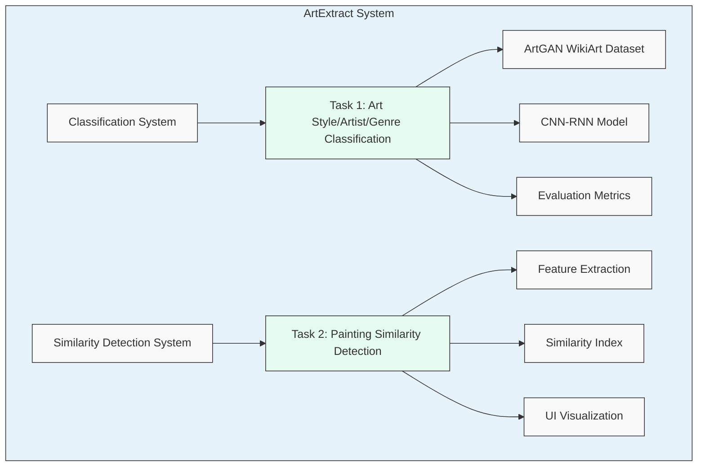
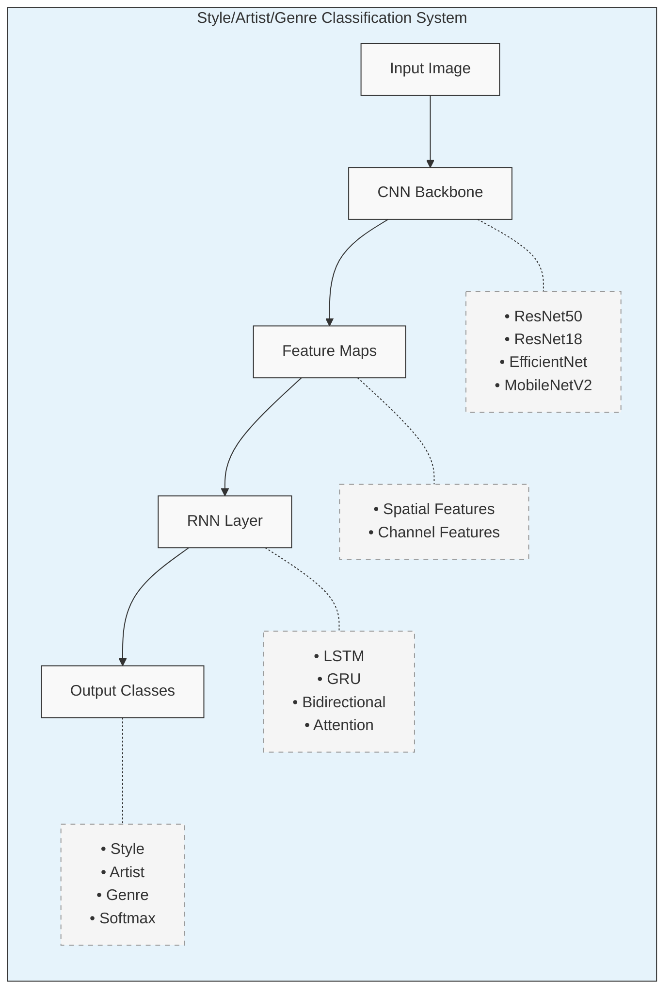
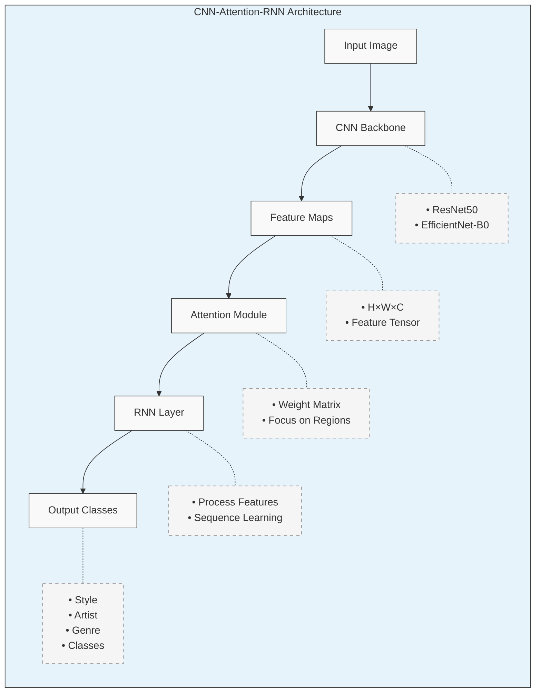
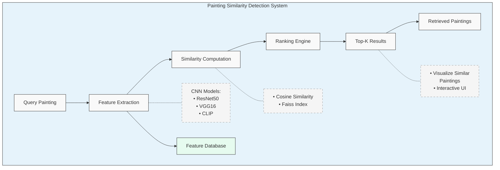
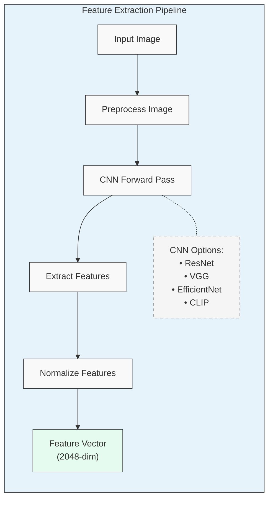
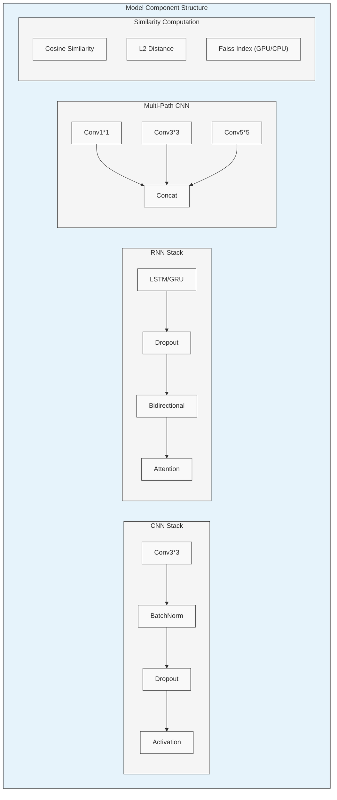

# ArtExtract

A deep learning project for art classification and similarity detection using advanced convolutional-recurrent neural network architectures.

## Project Overview

ArtExtract combines computer vision and deep learning techniques to analyze and understand artistic content. The system leverages hybrid CNN-RNN architectures to perform two primary tasks:

### Task 1: Style/Artist/Genre Classification
- Advanced convolutional-recurrent model for art classification using the ArtGAN WikiArt dataset
- Multiple CNN backbones (ResNet50/18, EfficientNet, MobileNetV2) 
- RNN options (LSTM, GRU) with bidirectional capabilities
- Attention mechanism for focusing on relevant artistic features
- Classifies artwork by style, artist, genre, and other attributes
- Outlier detection in classifications
- Comprehensive evaluation metrics

### Task 2: Painting Similarity Detection
- Sophisticated similarity model for paintings from the National Gallery of Art dataset
- Focus on finding similar portraits, poses, or compositions
- Feature extraction using CNN and CLIP models
- Multiple similarity metrics including cosine similarity and Faiss indexing
- Interactive visualization of similar paintings
- Documented approach and evaluation metrics

## Architecture

### System Overview



### CNN-RNN Classification Architecture



### Enhanced CNN-Attention-RNN Architecture



### Painting Similarity Detection System



### Feature Extraction Pipeline



## Technical Implementation

### CNN-RNN Classification Model

The CNN-RNN classification model combines the spatial feature extraction capabilities of CNNs with the sequential modeling power of RNNs:

1. **CNN Backbone**: Extracts rich visual features from artwork images
   - Supports multiple architectures: ResNet50/18, EfficientNet-B0, MobileNetV2
   - Pretrained on ImageNet and fine-tuned on art datasets
   - Outputs feature maps that capture artistic elements

2. **Feature Processing**: Transforms CNN features for RNN consumption
   - Reshapes spatial features to sequential format
   - Optional attention mechanism to focus on discriminative regions
   - Maintains spatial relationships in feature representation

3. **RNN Layer**: Processes sequential information in the feature maps
   - LSTM or GRU cells with optional bidirectional processing
   - Captures temporal and spatial relationships between features
   - Attention mechanism for highlighting important features

4. **Classification Layer**: Produces final style/artist/genre predictions
   - Fully-connected layer with softmax activation
   - Multi-class classification with confidence scores
   - Optional outlier detection for identifying unusual artwork

### Painting Similarity System

The similarity detection system finds paintings with similar visual characteristics:

1. **Feature Extraction**: Extracts deep features from paintings
   - CNN-based extraction using ResNet, VGG16, or EfficientNet
   - CLIP-based extraction for semantic understanding
   - Produces high-dimensional feature vectors (2048-dim)

2. **Similarity Index**: Efficiently computes similarity between paintings
   - Faiss index for fast approximate nearest neighbor search
   - Supports different distance metrics (L2, inner product, cosine)
   - GPU acceleration for large-scale similarity computation

3. **Similarity Retrieval**: Finds and ranks similar paintings
   - Retrieves top-K most similar paintings
   - Ranks results by similarity score
   - Interactive visualization of similar artwork

### Model Components



## Project Structure

```
ArtExtract/
├── data/                             # Data storage and preprocessing
│   ├── preprocessing/                # Scripts for data loading and preprocessing
│   └── README.md                     # Data documentation
│
├── models/                           # Model implementations
│   ├── style_classification/         # CNN-RNN models for classification
│   │   ├── cnn_rnn_model.py          # CNN-RNN architecture implementation
│   │   └── outlier_detection.py      # Outlier detection methods
│   │
│   ├── similarity_detection/         # Similarity models
│   │   ├── feature_extraction.py     # Feature extraction from paintings
│   │   ├── similarity_model.py       # Similarity model implementations
│   │   ├── train_similarity_model.py # Training script for similarity models
│   │   └── demo_similarity.py        # Demo script for similarity detection
│   │
│   └── utils.py                      # Shared utilities
│
├── notebooks/                        # Jupyter notebooks for exploration and visualization
│   └── similarity_detection_demo.ipynb  # Demo notebook for similarity detection
│
├── evaluation/                       # Evaluation metrics and scripts
│   ├── classification_metrics.py     # Metrics for classification task
│   └── similarity_metrics.py         # Metrics for similarity detection task
│
├── requirements.txt                  # Project dependencies
└── README.md                         # Project documentation
```

## Data Flow

```mermaid
flowchart TD
    subgraph DataFlow["ArtExtract Data Flow"]
        InputData["Input Datasets"] --> Preprocess["Preprocessing"]
        Preprocess --> Training["Training"]
        Training --> ModelTraining["Model Training"]
        ModelTraining --> Validation["Validation"]
        
        Validation --> TrainedModels["Trained Models"]
        TrainedModels --> DataAnalyze["Data to Analyze"]
        DataAnalyze --> Inference["Inference"]
        
        Inference --> Results["Results & Analysis"]
        Results --> Visualization["Visualization UI"]
    end
    
    classDef default fill:#f9f9f9,stroke:#333,stroke-width:1px;
    classDef systemNode fill:#e6f3fb,stroke:#333,stroke-width:1px;
    classDef dataNode fill:#e6fbef,stroke:#333,stroke-width:1px;
    classDef modelNode fill:#f0e6fb,stroke:#333,stroke-width:1px;
    
    class DataFlow systemNode;
    class InputData,Preprocess,DataAnalyze,Results dataNode;
    class TrainedModels,Inference modelNode;
```



## Setup and Installation

1. Clone the repository:
   ```bash
   git clone https://github.com/yourusername/ArtExtract.git
   cd ArtExtract
   ```

2. Install dependencies:
   ```bash
   pip install -r requirements.txt
   ```

3. Download the datasets:
   - ArtGAN WikiArt dataset: https://github.com/cs-chan/ArtGAN/blob/master/WikiArt%20Dataset/README.md
   - National Gallery of Art dataset: https://github.com/NationalGalleryOfArt/opendata

4. Prepare data:
   ```bash
   python data/preprocessing/prepare_data.py --dataset wikiart --output_dir data/processed/wikiart
   python data/preprocessing/prepare_data.py --dataset nga --output_dir data/processed/nga
   ```

## Usage

### Style/Artist/Genre Classification

Use the CNN-RNN model for art classification:

```python
from models.style_classification.cnn_rnn_model import CNNRNNModel

# Initialize model
model = CNNRNNModel(
    num_classes=10,
    cnn_backbone='resnet50',
    rnn_type='lstm',
    bidirectional=True,
    use_attention=True
)

# Load pre-trained weights
model.load_weights('path/to/weights.h5')

# Predict on an image
import cv2
import numpy as np

img = cv2.imread('path/to/artwork.jpg')
img = cv2.resize(img, (224, 224))
img = img / 255.0  # normalize
img = np.expand_dims(img, axis=0)  # add batch dimension

predictions = model.predict(img)
```

### Attention Visualization

Visualize the attention weights to understand which parts of the artwork influence classification:

```python
from models.style_classification.visualization import visualize_attention

# Get attention weights and visualize
attention_weights = model.get_attention_weights(img)
visualize_attention(img, attention_weights, save_path='attention_map.jpg')
```

### Painting Similarity Detection

#### Feature Extraction

Extract features from paintings:

```python
from models.similarity_detection.feature_extraction import FeatureExtractor

# Initialize feature extractor (options: 'resnet50', 'vgg16', 'clip')
extractor = FeatureExtractor(model_type='resnet50')

# Extract features from an image
features = extractor.extract_features_from_image(image)

# Extract features from a directory of images
features_dict = extractor.extract_features_from_directory('path/to/images/')
```

#### Finding Similar Paintings

Find similar paintings using the similarity model:

```python
from models.similarity_detection.similarity_model import (
    create_similarity_model,
    PaintingSimilaritySystem
)

# Create similarity model (options: 'cosine', 'faiss')
similarity_model = create_similarity_model('faiss', feature_dim=2048)

# Create painting similarity system
similarity_system = PaintingSimilaritySystem(
    similarity_model=similarity_model,
    features=features,
    image_paths=image_paths
)

# Find similar paintings to a query image
result = similarity_system.find_similar_paintings(query_idx=0, k=5)

# Find similar paintings to a new image
new_image = cv2.imread('path/to/new_artwork.jpg')
similar_paintings = similarity_system.find_similar_to_new(new_image, k=5)
```

#### Interactive Demo

Run the interactive similarity detection demo:

```bash
python models/similarity_detection/demo_similarity.py --model_path path/to/model --interactive
```

## Evaluation Metrics

### Classification Metrics

The classification models are evaluated using:
- Accuracy: Overall correctness of predictions
- Precision & Recall: Measure of exactness and completeness
- F1 Score: Harmonic mean of precision and recall
- Confusion Matrix: Detailed breakdown of classification performance
- ROC Curve and AUC: Performance across different thresholds

### Similarity Metrics

The similarity models are evaluated using:
- Precision@k: Precision of the top-k retrieved results
- Mean Average Precision (MAP): Overall precision across all queries
- Normalized Discounted Cumulative Gain (NDCG): Ranking quality measure
- User Studies: Human evaluation of similarity results

## Notebooks

Explore the project in depth with our Jupyter notebooks:
- [Classification Demo](notebooks/classification_demo.ipynb): Walkthrough of art classification
- [Similarity Detection Demo](notebooks/similarity_detection_demo.ipynb): Interactive similarity visualization
- [Model Evaluation](notebooks/model_evaluation.ipynb): Performance analysis of models

## Future Work

We are actively working on enhancing ArtExtract with:
- Transformer-based architectures (Vision Transformer)
- Multi-modal models combining image and textual descriptions
- Self-supervised learning approaches for improved feature extraction
- Style transfer capabilities
- Interactive web application for art exploration

## Citation

If you use ArtExtract in your research, please cite:

```
@software{ArtExtract2023,
  author = {Your Name},
  title = {ArtExtract: Deep Learning for Art Classification and Similarity Detection},
  year = {2023},
  url = {https://github.com/yourusername/ArtExtract}
}
```

## License

This project is licensed under the MIT License - see the [LICENSE](LICENSE) file for details.
