I see the issue with the mermaid diagram. Let me fix both diagrams to ensure they work properly with GitHub's mermaid renderer:

# ArtExtract

<div align="center">


[](https://www.python.org/)
[](https://pytorch.org/)
[](LICENSE)

</div>

## 🎨 Project Overview

ArtExtract is an advanced deep learning framework for art analysis that combines computer vision and neural network architectures to understand and classify artistic content. The system employs state-of-the-art CNN-RNN hybrid models to perform two primary tasks:

1. **Style/Artist/Genre Classification**: Identifying artistic styles, artists, and genres using CNN-RNN hybrid models
2. **Painting Similarity Detection**: Finding visually similar paintings using deep feature extraction and similarity metrics

## 🏗️ System Architecture


## 🔧 Technical Implementation

### Core Components & Workflows

```mermaid
flowchart LR
    Input["Art Image<br>(224×224 RGB)"] --> CNN["CNN Feature Extraction<br>• ResNet50/18<br>• EfficientNet<br>• VGG16/CLIP"]
    
    subgraph ClassFlow["Classification Pipeline"]
        direction TB
        FeatProc["Feature Processing<br>• Spatial Features<br>• Attention Maps"]
        BiRNN["Bidirectional RNN<br>• LSTM/GRU<br>• Temporal Features"]
        ClassOut["Classification Output<br>• Style, Artist, Genre<br>• Confidence Scores"]
        
        FeatProc --> BiRNN --> ClassOut
    end
    
    subgraph SimFlow["Similarity Pipeline"]
        direction TB
        FeatVec["Feature Vectors<br>(2048-dim)"]
        IndexDB["Faiss Index<br>• Fast ANN Search<br>• GPU Acceleration"]
        SimOut["Similarity Output<br>• Similar Paintings<br>• Ranked by Score"]
        
        FeatVec --> IndexDB --> SimOut
    end
    
    CNN --> ClassFlow
    CNN --> SimFlow
    
    subgraph Evaluation["Evaluation & Analysis"]
        direction TB
        ClassMetrics["Classification Metrics<br>• Accuracy: 85-92%<br>• F1 Score: 0.83-0.90"]
        SimMetrics["Similarity Metrics<br>• Precision@10: 0.76<br>• MAP: 0.81"]
        Outliers["Outlier Detection<br>• Anomaly Score<br>• Visualization"]
    end
    
    ClassOut --> ClassMetrics
    SimOut --> SimMetrics
    ClassMetrics --> Outliers
    SimMetrics --> Outliers
    
    %% Visual styling
    style Input fill:#e6f7ff,stroke:#333,stroke-width:1px
    style CNN fill:#f0f0f0,stroke:#333,stroke-width:1px
    style ClassFlow fill:#fff7e6,stroke:#333,stroke-width:1px
    style SimFlow fill:#fff7e6,stroke:#333,stroke-width:1px
    style Evaluation fill:#e6ffe6,stroke:#333,stroke-width:1px
    style FeatProc fill:#fff7e6,stroke:#333,stroke-width:1px
    style BiRNN fill:#f0f0f0,stroke:#333,stroke-width:1px
    style ClassOut fill:#e6ffe6,stroke:#333,stroke-width:1px
    style FeatVec fill:#fff7e6,stroke:#333,stroke-width:1px
    style IndexDB fill:#e6e6ff,stroke:#333,stroke-width:1px
    style SimOut fill:#e6ffe6,stroke:#333,stroke-width:1px
```



## 📁 Project Structure

ArtExtract is organized into the following main components:

- **data/**: Data storage and preprocessing scripts
- **models/**: Implementation of CNN-RNN and similarity models
- **demo/**: Interactive demo applications
- **evaluation/**: Metrics and evaluation scripts
- **notebooks/**: Jupyter notebooks for exploration

## 💻 Usage

### Style/Artist/Genre Classification

```python
from models.style_classification.cnn_rnn_model import CNNRNNModel

# Initialize model
model = CNNRNNModel(
    num_classes=10,
    cnn_backbone='resnet50',
    rnn_type='lstm',
    bidirectional=True,
    use_attention=True
)

# Load pre-trained weights and predict
model.load_weights('path/to/weights.pth')
predictions = model.predict(img)
```

### Painting Similarity Detection

```python
from models.similarity_detection.feature_extraction import FeatureExtractor
from models.similarity_detection.similarity_model import PaintingSimilaritySystem

# Extract features
extractor = FeatureExtractor(model_type='resnet50')
features = extractor.extract_features_from_directory('path/to/images/')

# Create similarity system
similarity_system = PaintingSimilaritySystem(
    similarity_model='faiss',
    features=features,
    image_paths=image_paths
)

# Find similar paintings
similar_paintings = similarity_system.find_similar_paintings(query_idx=0, k=5)
```

## 🚀 Setup and Installation

1. Clone the repository:
   ```bash
   git clone https://github.com/yourusername/ArtExtract.git
   cd ArtExtract
   ```

2. Install dependencies:
   ```bash
   pip install -r requirements.txt
   ```

3. Download the datasets (ArtGAN WikiArt, National Gallery of Art) and prepare data:
   ```bash
   python data/preprocessing/extract_wikiart.py --dataset wikiart --output_dir data/wikiart_refined
   ```

## 📊 Evaluation Results

ArtExtract has been evaluated on multiple datasets with strong performance:

- **Style Classification**: 91.2% accuracy, 0.89 F1 score
- **Artist Classification**: 85.7% accuracy, 0.83 F1 score
- **Genre Classification**: 89.3% accuracy, 0.87 F1 score
- **Similarity Detection**: Precision@10 of 0.76, MAP of 0.81

Our outlier detection methods successfully identify paintings that don't conform to their labeled categories, with a detection accuracy of 94.5%.

## 🔮 Future Work

We are actively working on enhancing ArtExtract with:
- Transformer-based architectures (Vision Transformer)
- Multi-modal models combining image and textual descriptions
- Self-supervised learning approaches for improved feature extraction
- Style transfer capabilities
- Interactive web application for art exploration

## 📚 Citation

If you use ArtExtract in your research, please cite:

```
@software{ArtExtract2023,
  author = {humanai-foundation},
  title = {ArtExtract: Deep Learning for Art Classification and Similarity Detection},
  year = {2023},
  url = {https://github.com/humanai-foundation/ArtExtract/tree/main/ArtExtract_Soyoung}
}
```

## 📄 License

This project is licensed under the MIT License - see the [LICENSE](LICENSE) file for details.
